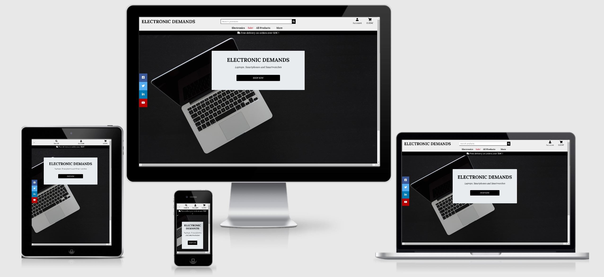

# ELECTRONIC DEMANDS :computer:

Visit the live website: [Electronic Demands](https://electronic-demands.herokuapp.com/) 

## Introduction 
Welcome to Electronic Demands!
Electronic Demands is the place for people who loves electronics. This is the place for people 
who wants the most popular electronics in the categories of laptops, smartphones and smartwatches. 
Plug in :electric_plug: and visit our webshop! 

## Table of Contents
* [UX](#ux)
    * [Project Goals](#project-goals)
    * [Site Owner Goals:](#site-owner-goals)
    * [User Stories](#user-stories)
    * [Design Choices](#design-choices)
    * [Wireframes](#wireframes)
    * [Databases](#databases)
* [Features](#features)
    * [Existing Features](#existing-features)
    * [Features Left to Implement](#features-left-to-implement)
* [Technologies Used](#technologies-used)
    * [Languages](#languages)
    * [Libaries & Frameworks](#libaries-&-frameworks)
    * [Databases](#databases)
    * [Tools](#tools)

* [Testing](#testing)
 
* [Deployment](#deployment)


* [Credits](#credits)
    * [Content](#content)
    * [Media](#media)
    * [Acknowledgements](#acknowledgements)

* [Disclaimer](#disclaimer)

## UX 

### Project Goals :dart: 
The aim of the project is to create a ecommerce website where users can view, sort and choose different products
in the gallery, got through the checkout process with their shopping bag and make a card payment through [Stripe](https://stripe.com/en-se).
The user can also create a personal profile where the can see all their historic order details.

### Site Owner Goals:

* Provide a platform for people who loves popular electronics in the categories of laptops, smartphones and smartwatches
* Make it easy for users to navigate, choose products, have an overview of their order details, get informed through the blog and keep connected through social media.
* Collect user information through site analytics to optimize the website for users

### User Stories :clapper: 
As a user i want to be able to.....
* :white_check_mark: view a list of all the products
* :white_check_mark: view a specific category of products
* :white_check_mark: view a list of products that are on sale
* :white_check_mark: sort the products by price
* :white_check_mark: sort the products by name
* :white_check_mark: sort products by category
* :white_check_mark: sort products by rating
* :white_check_mark: search products by name in a searchbox
* :white_check_mark: register to a personal account
* :white_check_mark: have a overview of my shopping bag and total amount
* :white_check_mark: change quantity of the product in the shopping bag
* :white_check_mark: to see an update of my shopping bag, when i add/delete a product
* :white_check_mark: have a pleasent, easy and secure payment process
* :white_check_mark: get an order confirmation, when payment/checkout process is confirmed 
* :white_check_mark: see my order history
* :white_check_mark: login and logout to my personal account
* :white_check_mark: read more about the company in a about page
* :white_check_mark: to contact the support if/when I have questions
* :white_check_mark: get more information about the product in a blog
* :white_check_mark: follow the company on social media

### Design Choices :art:

__Icons__
* Icons are being applied from [Font Awesome](https://fontawesome.com/)

 __Typography__
* Google Fonts were used across the site:
[Lora](https://fonts.google.com/specimen/Lora?query=lora) is the primary font used throughout the project
Sans-serif was chosen as the fallback font

__Color scheme__


### Wireframes
* The wireframes were created using [Balsamiq](https://balsamiq.com/).
    * Here is the link to see the [Wireframes](https://github.com/Sebastian-Torres-Matrix/ms4-ecommerce/tree/master/wireframes)


## Features :mag_right:

### Existing Features
__Users can:__
* sign up to ElectronicDemands, with a unique username and password
* log in to the website, with their unique username and password
* log out from the website
* add product to the shopping bag
* adjust, edit, remove and update existing shopping bag
* search for specific products in the products gallery
* sort products by order of price, name, category, a-z
* buy products with secure card payments
* have all historic personal order details in profile page
* contact support through contact form and get email confirmation
* get overall information about products through the company blog 
* follow Electronic Demands through social media

### Features Left to Implement
* Pagination when there are many products accumulated in the product gallery
* Add 404 page, for better UX
* Delete account, users should be able to delete their account if the wish to do so

### Data Models

__Blog Models__
Name | Field Type | Validation |
---- |:----------:| ----------:|
title | CharField | max_length=150
description | TextField | max_length=500
image | ImageField | blank=True, null=True)

__Contact Models__
Name | Field Type | Validation |
---- |:----------:| ----------:|
name | CharField | null=False, blank=False
email | EmailField | null=False, blank=False
message | TextField | null=False, blank=False

__Order Models__
Name | Field Type | Validation |
---- |:----------:| ---------:|
order_number | CharField | null=False, editable=False
user_profile | ForeignKey | null=True, blank=True
full_name | CharField | null=False, blank=False
email | EmailField | null=False, blank=False
phone_number | CharField | null=False, blank=False
country | CountryField | null=False, blank=False
postcode | CharField | null=True, blank=True
city | CharField | null=False, blank=False
address | CharField | null=False, blank=False
date | DateTimeField | auto_now_add=True
delivery_cost | DecimalField | null=False, default=0
order_total | DecimalField | null=False, default=0
grand_total | DecimalField | null=False, default=0
original_bag | TextField | null=False, blank=False, default=''
stripe_pid | CharField | null=False, blank=False, default=''

__OrderLineItems Models__
Name | Field Type | Validation |
---- |:----------:| ----------:|
order | ForeignKey | null=False, blank=False, on_delete=models.CASCADE, related_name='lineitems'
product | ForeignKey | null=False, blank=False, on_delete=models.CASCADE
quantity | IntegerField | null=False, blank=False, default=0
lineitem_total | DecimalField | null=False, blank=False, editable=False

__Product Models__
Name | Field Type | Validation |
---- |:----------:| ----------:|
category | ForeignKey| null=True, blank=True
sku | CharField | null=True, blank=True 
name | CharField | max_length=254
description | TextField |
price | DecimalField | max_digits=6
rating | DecimalField | null=True, blank=True
image_url | URLField | null=True, blank=True
image | ImageField | null=True, blank=True 

__Profile Models__
Name | Field Type | Validation |
---- |:----------:| ----------:|
user | OneToOneField | on_delete=models.CASCADE
phone_number | CharField | null=True, blank=True
address | CharField | null=True, blank=True
postcode | models.CharField | null=True, blank=True
city | CharField | null=True, blank=True
country | CountryField | null=True, blank=True


## Technologies Used :computer: 

### Languages
* HTML
* CSS 
* JavaScript 
* Python

### Libaries & Frameworks
* [Bootstrap](https://getbootstrap.com/) 
* [Django](https://www.djangoproject.com/) 
* [FontAwesome](https://fontawesome.com/)  
* [JQuery](https://jquery.com/) 


### Databases
* [PostgreSQL](https://www.postgresql.org/)
* [Sqlite3](https://www.sqlite.org/index.html)


### Tools :wrench:
* [Am I Responsive?](http://ami.responsivedesign.is/#) 
* [AWS S3 Bucket](https://aws.amazon.com/) 
* [Balsamiq](https://balsamiq.com/) 
* [Chrome DevTools](https://developers.google.com/web/tools/chrome-devtools) 
* [Git](https://git-scm.com/) 
* [Github](https://github.com/) 
* [Gitpod](https://www.gitpod.io/) 
* [Google Fonts](https://fonts.google.com/)
* [Heroku](https://dashboard.heroku.com/apps) 
* [Stripe](https://stripe.com) 


## Testing :electric_plug:
# Testing
:electric_plug:

### Validators

* [W3C Markup Validation](https://validator.w3.org/)
    - Was used to check HTML5 validation.
* [W3C CSS Validation](https://jigsaw.w3.org/css-validator/#validate_by_input)
    - Was used to check CSS3 validation.
* [Esprima Syntax Validaton](https://esprima.org/index.html)
    - Was used to check Javascript validation.
* [Python syntax checker](https://extendsclass.com/python-tester.html)
    - Was used to check Python validation.
* [PEP online](http://pep8online.com/)
    - Was used to check PEP8 validation.
* [AutoPrefixer](https://autoprefixer.github.io/)
    - Was used to make sure that CSS3 was valid for all web browsers.
* [Google Search Console](https://autoprefixer.github.io/)
    - Was used to make sure that Responsive design worked on all devices.
https://search.google.com/test/mobile-friendly?hl=sv
* [Google Chrome](https://www.google.com/intl/sv/chrome/)
    - Was used to test the web browser.
* [Chrome DevTools](https://developers.google.com/web/tools/chrome-devtools)
    - Was used to for debugging. 

## Features Testing

### Login, sign up and sign out
* __Testing__ :mag: : User fills the form with required inputs and submits the form. Testing 
that toast messages and redirection of page works correctly
* __Result__ :hammer: : The user can login, sign up and sign out from the website, by navigating
and using the forms and links.
links
* __Passed__ :white_check_mark: : Testing passed the expected criterias 

### Searchbox
* __Testing__ :mag: : Users can find a specific product, by typing in the searchbar and clicking on the button "search".
Testing that connection setup and search works correctly
* __Result__ :hammer: : searchbar works as expected. When searching for a specific product by typing for a specificproduct, the product
that the user search for, either is found or not
* __Passed__ :white_check_mark: : Testing passed the expected criterias

### Sort
* __Testing__ :mag: :
Testing that sorting works as intended for the specific sorting choice
* __Result__ :hammer: : The user can sort products by price, name, rating or category 
* __Passed__ :white_check_mark: : Testing passed the expected criterias 

### Adjust shopping bag
* __Testing__ :mag: : 
Testing that increment and decreament functionality works as intended, also remove and update products from the shopping bag.
* __Result__ :hammer: : 
The user can adjust their shopping bag, by addin, decreasing or remoing products from shopping bag
* __Passed__ :white_check_mark: : Testing passed the expected criterias 

### Checkout process
* __Testing__ :mag: : 
Testing that Stripe connection and card payment works as intended 
* __Result__ :hammer: : 
The user can make a secure and smooth card payment in the checkout process
* __Passed__ :white_check_mark: : Testing passed the expected criterias

### Order confirmation
* __Testing__ :mag: : 
Testing that the users gets a correct order cnfirmation after checkout process
Also that user can see and revisit order history intheir profile page
* __Result__ :hammer: : 
The user gets a order confirmation after payment and can see all their order history in their profile page.
* __Passed__ :white_check_mark: : Testing passed the expected criterias

### Contact us
* __Testing__ :mag: : 
Testing that users can us the contact us form and gets a confirmation when sending the form
* __Result__ :hammer: : 
The user gets an toast and email confirmation after sending the conctact form
* __Passed__ :white_check_mark: : Testing passed the expected criterias

### Navigation links
* __Testing__ :mag: : 
Testing that all navigation links, on the navbar, buttons and backlinks works and redirects to correct url
* __Result__ :hammer: : 
The user can navigate easily on the website by using the links, that redirects them to their intended destination
* __Passed__ :white_check_mark: : Testing passed the expected criterias

### Social Media Icons
* __Testing__ :mag: : Users can use social media links to navigate to the websites specific social media account.
Testing that by clicking on social media link, the user gets navigated to the chosen social media account.
* __Result__ :hammer: : When clicking on social media icon, the user gets naviagated to the specific social media account. 
* __Passed__ :white_check_mark: : Testing passed the expected criterias 

### Responsive Design
* __Testing__ :mag: : Users can use different devices to navigate on the website.
Testing that the website works correctly on different devices and adjust on the responsive breakpoints.
* __Result__ :hammer: : The website is responsive on the different devices breakpoints and works correctly.
* __Passed__ :white_check_mark: : Testing passed the expected criterias 

## Notable Bugs

### Remove and update button
* __Bug__ :bug: :  The buttons remove and update onclick, in the shopping bag were not responding. 
They did not remove or updated the shopping bag, when clicking on this buttons 
* __Resolved__ :key: :  
For the remove button, csrf token wasn't being read in properly. The JS code can only be accessed in the HTML file, not in the JS file.
The update button needed to be ordered before the delete button in the html, as the prev() function only gets the immediately preceding element. 
* __Passed__ :white_check_mark: :

### Responsive design
* __Bug__ :bug: : Had some bugs with the responsive design, when switching font-size (10px = 1 rem) from px the rem and deploying to Amazon AWS.
All font-size became very small and  CSS was not responding to changes.
* __Resolved__ :key: : Started redifining font-sizes for p, h1, h2 and so on with rem and adding to all typography in templates with classes.
Commented out AWS code in settings.py until project was all done, so that css responded to changes locally.
* __Passed__ :white_check_mark: :

## Deployment
### Run this project locally:
1. Save a copy of the github repository located at https://github.com/Sebastian-Torres-Matrix/ms4-ecommerce 
by clicking the 'download.zip' button at the top of the page and extracting the zip file to your chosen folder. 
If you have Git installed on your system, you can clone the repository with the following command:
```
git clone https://github.com/Sebastian-Torres-Matrix/ms4-ecommerce.git
```

2. Set up a virtual environment via this command in the terminal session:
```
python -m venv env
```
3. Activate the .venv with the command:
```
\env\Scripts\activate.bat
```
4. Install all required modules with the command:
```
pip install -r requirements.txt
```
5. Create a env.py file and add it to your .gitignore

6. Copy the following into the env.py file:
```
import os

os.environ['SECRET_KEY'] = 'your value'
os.environ['DATABASE_URL'] = 'your value'
os.environ['STRIPE_PUBLIC_KEY'] = 'your value'
os.environ['STRIPE_SECRET_KEY'] = 'your value'
os.environ['STRIPE_WH_SECRET'] = 'your value'
os.environ['AWS_STORAGE_BUCKET_NAME'] = 'your value'
os.environ['AWS_ACCESS_KEY_ID'] = 'your value'
os.environ['AWS_SECRET_ACCESS_KEY'] = 'your value'
os.environ['DEVELOPMENT'] = '1'
```

7. Set up the databases by running the following management command in your terminal:
```
python manage.py migrate
```

8. Create the superuser so you can have access to the django admin:
```
python manage.py createsuperuser
```
9. Start your server by running the following command in your terminal:
```
python manage.py runserver
```

### Deployment to Heroku:
1. Create a requirements.txt file using the following command.
```
pip3 freeze > requirements.txt
```
2. Create a Procfile with the following command.
```
echo web: python3 app.py > Procfile
```
3. Push these created files to your repository.
4. Create a new app for this project on the Heroku Dashboard.
5. Select your deployment method by clicking on the deployment method button and select GitHub.
6. On the dashboard, set the following config variables:

Key | Value
-----|------
AWS_ACCESS_KEY_ID | <your_secret_key>
AWS_SECRET_ACCESS_KEY | <your_secret_key>
DATABASE_URL | <your_postgres_database_url>
EMAIL_HOST_PASS | <your_value>
EMAIL_HOST_USER | <your_value>
SECRET_KEY | <your_secret_key>
STRIPE_PUBLIC_KEY | <your_value>
STRIPE_SECRET_KEY | <your_secret_key>
STRIPE_WH_SECRET | <your_secret_key>
USE_AWS | True

7. Click the deploy button on the Heroku dashboard.
8. The site has been deployed to Heroku.

## Credits 

### Content
* These websites, for the excellent content, with explanations and tutorials:
    * [StackOverflow](https://stackoverflow.com/)
    * [W3Schools](https://www.w3schools.com/)
    * [Youtube](https://www.youtube.com/results?search_query=django+tutorials)
    * [Django Documentation](https://docs.djangoproject.com/en/3.0/)
    * [Django-allauth Documentation](https://django-allauth.readthedocs.io/en/latest/) 
    * [Code Institute, Django module](https://courses.codeinstitute.net/program/FullstackWebDeveloper) 
 
### Media
* [Favicon.io](https://favicon.io/)
    * For the favicon used in the project.
* [Optimizilla](https://imagecompressor.com/)
    * Image compressor to shrink JPEG and PNG images. 
* [Pexels](https://www.pexels.com) 
    * For the background image used in the project.  
* [Amazon](https://www.amazon.com/s?k=smartwatch&ref=nb_sb_noss_1) 
    * For the product images used in the project.


### Acknowledgements
* Fellow Code Institute students on [Slack](https://slack.com/intl/en-se/). For the support and feedback.
* Tutor support and Student care from Code Institute. For the support, guidance and feedback.
* [Simen Daehlin](https://dehlin.dev/), for excellent mentorship, with great guidance and feedback. :trophy:
    * [Github](https://github.com/Eventyret)
    * [Linkedin](https://uk.linkedin.com/in/simendaehlin)


## Disclaimer 
* The content of this website is for educational purpose only :heavy_exclamation_mark:

## Back to the top 
* [Table of Contents](#table-of-contents) :arrow_up: